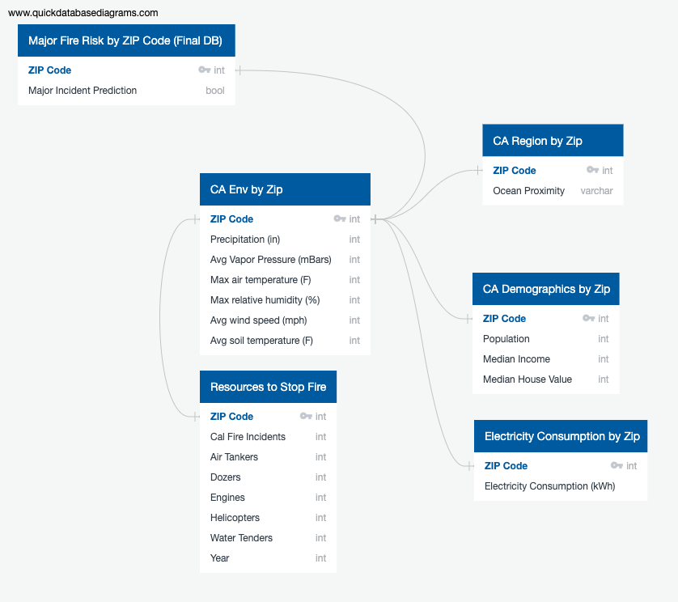

# Final Project - Group 4
A shared repository for our final project

## Presentation

Presentation slides - [LINK](https://docs.google.com/presentation/d/1ZyAf5inS5cdrgjLXJzkdfpqEq0bM7Uo2M7a02_pBoic/edit?usp=sharing)

#### Selected Topic 

We will be analyzing California wildfire risk, specifically what factors contribute to a wildfire being classified as a major fire event. Cal Fire defines a major fire event as an extended-day wildfire that is 10 acres or greater. By utilizing historical California wildfire, housing and environmental conditions datasets, we hope to identify the factors that most commonly increase the risk of a wildfire becoming a major fire event.

### Reason why they selected topic

California has recently had some of the most deadly and destructive fire seasons. With the state entering an extreme drought, the 2021 fire season is expected to be very high risk. With this analysis, main contributing factors will be identified and resources can be allocated to decrease the risk of major wildfire events in California regions. 

### Description of their source of data

All datasets are from Kaggle 

**California Wildfires (2013-2020)**
- The dataset contains the list of wildfires that have occurred in California between 2013-2020. The dataset includes the location of the fire, including county and latitude and longitude. Several values are included for each fire, some of which are acres burned, fuel type and if the fire was considered a major fire event.  

**California Housing Data**
- The California housing data include location, population size of the block, house value and median income.

**California Environmental Conditions Dataset**
- The California Environmental Conditions dataset was pulled from the CIMIS weather stations and includes weather information organized by region. Data includes precipitation, air temperature relative humidity and wind speed. 

**California - Electricity Consumption by County Dataset**
- Historical energy cosumption data by county. 

#### Questions they hope to answer with the data

1) What factors contribute to certain California fires becoming a major fire event? 
2) Which factor(s) are main contributors to increasing the risk of a California fire becoming a major fire event?

#### Description of the data exploration phase of the project

- We began with the California Wildfires (2013-2020) dataset
  - Identify columns of interest 
  - Drop columns 
  - Missing data, Resources columns (personnel units, airtankers, enginges, etc.) inaccurate and inconsistent, cross referencing CalFire website
  - Decision to drop columns with missing data 

- California Housing Dataset
  - dropped columns (Housing_median_age, total_rooms, total_bedrooms)

- California Environmental Conditions Dataset
  - dropped columns (target, region)

- California - Electricity Consumtion by County Dataset
  - dropped columns (non-residential, residential)

Boxplot to view column outliers 

#### Description of the analysis phase of the project

Boxplot outliers
database tables
Initial machine learning 

#### Technologies
### Technologies Used

**Code and Workbooks**
 As we have discussed, a lot of what we'll be doing will be in Python. To hold our code, we will be taking advantage of Jupyter Notebooks for our IDE and Github for our shared repository.

**Initial Data Cleaning**
 To thoroughly edit and manipulate the data, the Python Pandas library will be used here. To aid with any data cleaning, other libraries such as Matplotlib and hvplot may be required to gain a better sense on the individual variables being used, to spot outliers and determine significance in some of the data. 

**Binary Classification**
 With the likelihood of a major fire event as a binary classifier and our dependent variable, the tools we use should reflect this. Machine learning models such as logistic regression can be deemed useful for our machine learning classification. Predicting the likelihood of a major event or not based on our variables is an important part of answering the question we are trying to solve. For this project, we will use TensorFlow, a Python library, to create a deep learning neural network based on a logistic regression model to determine whether a wildfire is a major wildfire or not.

**Data Storage**
 In addition to the machine learning models, our database can be stored in MongoDB for easy access. The applicable Pymongo library may also be used to integrate our database into our models.   

**Dashboard Analysis**
 Visualization tools such as Tableau will be of great use for our analysis. The ability to visualize the data in a geographic format with many variables at play will be extremely useful. 

## GitHub

#### Communication Protocols

1) Slack group chat will be used to share resources, ask questions and coordinate progress on deliverables.
2) The 7-9 pm PST workblock will be used for group working sessions
3) Main branch merge and weekly submissions will be coordinated by repository team member aligned with team established deadline.

## Machine Learning Model

### Purpose:

The purpose of this analysis is to analyze which factors from previous California (CA) wildfires made that wildfire into either a major wildfire or not. To perform this analysis, we will use the following features (X) taken from the provisional database that we created and input them into a supervised machine learning model to predict whether a wildfire was a major wildfire or not (y):
#### Environmental Factors
- Precipitation (in) in ZIP code
- Average vapor pressure (mBars) in ZIP code
- Maximum air temperature (F) in ZIP code
- Maximum relative humidity (%) in ZIP code
- Average wind speed (mph) in ZIP code
- Average soil temperature (F) in ZIP code
#### Region
- The ZIP codes in which wildfires started and occurred
- The proximity of that ZIP code to the ocean
#### Demographics
- Population of ZIP code
- Median income of ZIP code
- Median house value of ZIP code
#### Electricity
- Electricity consumption per ZIP code
#### Amount of Resources Allocated to Stop Fire
- Number of Air Tankers
- Number of Cal Fire Incidents
- Number of Dozers
- Number of Engines
- Number of Helicopters
- Number of Water Tenders
#### Time
- Year

Historically, high wind speed and dry heat contribute to the ignition and exacerbation of wildfires in CA. Therefore, inputting these environmental factors along with others into our supervised machine learning model will help predict whether a wildfire becomes a major wildfire or not.

Additionally, inputting ZIP codes where previous wildfires have started and occurred will help predict whether the wildfire was major or not. Also, inputting the proximity of these ZIP codes to the ocean will aid in this prediction as wildfires are typically inland.

Demographics of a region may also help in predicting wildfire outcomes such as the population of a ZIP code, median income of a ZIP code, and the median house value of a ZIP code.

Another interesting factor that may aid in predicting major wildfire risk is the electricity consumption per ZIP code.

Likewise, the amount of resources used to stop the fire such as the number of air tankers deployed and number of water tenders utilized will help predict whether the wildfire became a major wildfire or not.

Finally, the year that the wildfire occurred will help in predicting whether the wildfire became a major wildfire incident or not as the factors that contribute to wildfire risk like environmental factors may change over time to increase or decrease the likelihood of major wildfire incidents.

Ultimately, knowing these factors will give insight as to which California (CA) ZIP codes are more at risk of suffering from major wildfires and will guide future decisions in allocating more resources to ZIP codes where the likelihood of major wildfire risk is high.

### Description & Explanation of Model:

- **Which model did you choose and why?**
  - We chose a **supervised machine learning model** based on a **logistic regression model** because we want to predict whether a wildfire was a major wildfire or not.
- **How are you training your model?**
  - We are training our model on a **logistic regression model** because our output, y, is binary: major wildfire **or** not a major wildfire. 75% of our data will be training data, while the other 25% of our data will be testing data.
- **What is the model's accuracy?**
  - To be determined.
- **How does this model work?**
  - This supervised machine learning model will be built as a deep learning neural network because a deep learning neural network will learn and figure out relationships between the various variables. Likewise, it will be able to determine which input features are more significant in determining whether a wildfire becomes a major wildfire or not.

## Database

Below is an ERD that shows the provisional database that will turn into our final database. There are six databases featured in the ERD. Five of these represent cleaned-up versions of our Kaggle Datasets. Important to note, most of the datasets do not feature the data that will be our primary key: ZIP codes. Part of our initial data clean-up process will be to convert the latitude and longitude data provided in each data source into a corresponding ZIP code. All other information will be pulled from the data sources from Kaggle and cleaned accordingly. For example, in the "CA Region by Zip" table, once we have determined the ZIP code from the latitude and longitude, we will group the "Ocean Proximity" labels by the ZIP code associated with it.

The "Major Fire Risk by ZIP Code" database will be the data we receive from our machine learning model. The model would predict whether a wildfire was at risk of becoming a major wildfire incident or not and group the results by the ZIP code it predicted. This prediction will give us more insight on which areas of the state would benefit from close monitoring and additional/modified resources to avoid a wildfire from becoming a major incident.

- Create a document describing the schema of the database (this can be a markdown document or an ERD).

## Dashboard

Dashboard Storyboard - [LINK](https://docs.google.com/presentation/d/1ZyAf5inS5cdrgjLXJzkdfpqEq0bM7Uo2M7a02_pBoic/edit#slide=id.ge0f4930212_0_52)

Description of the tool(s) that will be used to create the final dashboard
- Tableau

Description of interactive element(s)
- Map (counties, fires (location & acres burned), housing, electricity consumption)

