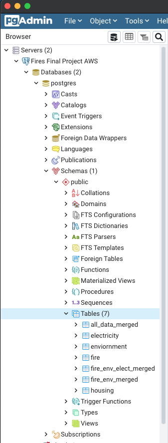
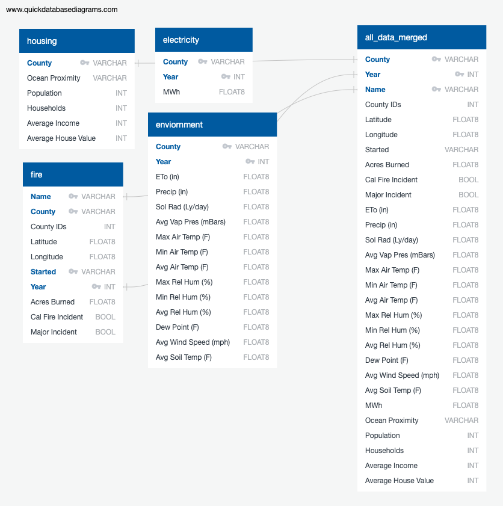

# Final Project - Group 4
A shared repository for our final project.

---

## Presentation

### Presentation slides - [LINK](https://docs.google.com/presentation/d/1ZyAf5inS5cdrgjLXJzkdfpqEq0bM7Uo2M7a02_pBoic/edit?usp=sharing)

### Selected Topic: 

We will be analyzing California wildfire risk, specifically what factors contribute to a wildfire being classified as a major fire event. Cal Fire defines a major fire event as an extended-day wildfire that is 10 acres or greater. By utilizing historical California wildfire, housing and environmental conditions datasets, we hope to identify the factors that most commonly increase the risk of a wildfire becoming a major fire event.

### Why We Want to Investigate the Factors that Cause Major Wildfire Incidents:

California has recently had some of the most deadly and destructive fire seasons. With the state entering an extreme drought, the 2021 fire season is expected to be very high risk. With this analysis, main contributing factors will be identified and resources can be allocated to decrease the risk of major wildfire events in California regions. 

### Original Data Source:

We curated the four following data sets from Kaggle for our analysis:

**California Wildfires (2013-2020)**
- The dataset contains the list of wildfires that have occurred in California between 2013-2020. The dataset includes the location of the fire, including county and latitude and longitude. Several values are included for each fire, some of which are acres burned, fuel type and if the fire was considered a major fire event. 

**California Housing Data**
- The California housing data include location, population size of the block, house value and median income.

**California Environmental Conditions Dataset**
- The California Environmental Conditions dataset was pulled from the CIMIS weather stations and includes weather information organized by region. Data includes precipitation, air temperature relative humidity and wind speed. 

**California - Electricity Consumption by County Dataset**
- Historical energy consumption data by county. 

### Questions We Hope to Answer:

1) What factors contribute to certain California fires becoming a major fire event? 
2) Which factor(s) are main contributors to increasing the risk of a California fire becoming a major fire event?
3) How does proximity to major fire events impact housing prices over time?
4) Is there a relationship between number of fires (or acres burned) and energy consumption? 
5) What weather patterns increase the risk for a major fire event?

### Data Exploration Phase:

- We began with the California Wildfires (2013-2020) dataset
  - Identify columns of interest 
  - Drop columns 
  - Missing data, Resources columns (personnel units, air-tankers, engines, etc.) inaccurate and inconsistent, cross referencing CalFire website
  - Decision to drop columns with missing data 

- California Housing Dataset
  - dropped columns (Housing_median_age, total_rooms, total_bedrooms)

- California Environmental Conditions Dataset
  - dropped columns (target, region)

- California - Electricity Consumption by County Dataset
  - dropped columns (non-residential, residential)

- Utilize Boxplot to view column outliers 
- Convert data types 
- Duplicate weather condition data for counties not represented by using county data from similar climate zones. 

### Data Analysis Phase:

During the analysis phase, we focused on:
- Creating a Boxplot to identify outliers
- Creating our database tables 
- Our initial approach to our machine learning model

---

## Technologies Used

**Code and Workbooks**
 As we have discussed, a lot of what we'll be doing will be in Python. To hold our code, we will be taking advantage of Jupyter Notebooks for our IDE and Github for our shared repository.

**Initial Data Cleaning**
 To thoroughly edit and manipulate the data, the Python Pandas library will be used here. To aid with any data cleaning, other libraries such as Matplotlib and hvplot may be required to gain a better sense on the individual variables being used, to spot outliers and determine significance in some of the data. 

**Machine Learning Model**
 With the likelihood of a major fire event as a binary classifier and our dependent variable, the tools we use should reflect this. Machine learning models such as logistic regression can be deemed useful for our machine learning classification. Predicting the likelihood of a major event or not based on our variables is an important part of answering the question we are trying to solve. For this project, we will use TensorFlow, a Python library, to create a deep learning neural network based on a logistic regression model to determine whether a wildfire is a major wildfire or not.

**Data Storage**
 In order to provide the machine learning models with the data needed, our database is stored in pgAdmin using Amazon Web Services for easy shareable access. Additionally, our final database that the machine learning model will pull from an S3 bucket hosted through AWS as well. Thus allowing for streamlined and cloud based access for our database and all necessary datasets.

**Dashboard Analysis**
 Visualization tools such as Tableau will be of great use for our analysis. The ability to visualize the data in a geographic format with many variables at play will be extremely useful. 

---

## Machine Learning Model

### Link: https://colab.research.google.com/drive/1fDJt_U9evtU20pq53nccp1hQQdgFUkpN?usp=sharing

### Purpose:

The purpose of this analysis is to analyze which factors from previous California (CA) wildfires made that wildfire into either a major wildfire or not. To perform this analysis, we will use the following features (X) taken from the provisional database that we created and input them into a supervised machine learning model to predict whether a wildfire was a major wildfire or not (y):
#### Environmental Factors
- ETo (in) in County
- Precip (in) in County
- Sol Rad (Ly/day) in County
- Avg Vap Pres (mBars) in County
- Max Air Temp (F) in County
- Min Air Temp (F) in County
- Avg Air Temp (F) in County
- Max Rel Hum (%) in County
- Min Rel Hum (%) in County
- Avg Rel Hum (%) in County
- Dew Point (F) in County
- Avg Wind Speed (mph) in County
- Avg Soil Temp (F) in County
#### Region
- The County in which wildfires occurred
- The proximity of that County to the ocean
#### Demographics
- Population of County
- Average income of County
- Average house value of County
#### Characteristics of Wildfire
- Latitude and longitude coordinates where fire started
- Number of acres fire burned
- Cal Fire Incident, meaning did Cal Fire get involved in handling the fire or not
#### Electricity
- Electricity consumption measured in MWh per County
#### Time
- Year

Historically, high wind speed and dry heat contribute to the ignition and exacerbation of wildfires in CA. Therefore, inputting these environmental factors along with others into our supervised machine learning model will help predict whether a wildfire becomes a major wildfire or not.

Additionally, inputting Counties where previous wildfires have started and occurred will help predict whether the wildfire was major or not. Also, inputting the proximity of these Counties to the ocean will aid in this prediction as wildfires are typically inland.

Demographics of a region may also help in predicting wildfire outcomes such as the population of a County, median income of a County, and the median house value of a County.

Likewise, characteristics of the wildfire itself like the number of acres the fire burned and coordinates of where it started may help determine the possibility of a wildfire becoming a major incident or not.

Another interesting factor that may aid in predicting major wildfire risk is the electricity consumption per County.

Finally, the year that the wildfire occurred will help in predicting whether the wildfire became a major wildfire incident or not as the factors that contribute to wildfire risk like environmental factors may change over time to increase or decrease the likelihood of major wildfire incidents.

Ultimately, knowing these factors will give insight as to which California (CA) Counties are more at risk of suffering from major wildfires and will guide future decisions in allocating more resources to Counties where the likelihood of major wildfire risk is high.

### Description & Explanation of Model:

- **Which model did you choose and why?**
  - We chose a **deep learning neural network** with an output layer that has a **sigmoid activation function** because we want to predict whether a wildfire was a major wildfire incident or not.
- **How are you training your model?**
  - We are training our model on **20 epochs** as to not overfit the model. 75% of our data will be training data, while the other 25% of our data will be testing data.
- **What is the model's accuracy?**
  - The model's accuracy is **79.19%**.
- **How does this model work?**
  - This machine learning model is built as a deep learning neural network because a deep learning neural network will learn and figure out relationships between the various variables. Likewise, it will be able to determine which input features are more significant in determining whether a wildfire is a major wildfire or not.

### Code for Machine Learning Model:

- **The Data Preprocessing Stage**
  - In order to perform the machine learning model, we needed to preprocess all four datasets and merge them together by County and Year.
  - For all four data sets:
    - Unnecessary columns were dropped.
    - Data types were changed accordingly if the column data did not match the data type.
    - Columns were renamed and reordered for organization purposes.
    - The column "County" was made to be the same for all four data sets which included dropping any data pertaining to Imperial and San Francisco counties since the wildfire data set showed that no fires occurred in those counties from 2013-2019.
    - Duplicate data was dropped so that the model would not be overfitted.
    - Categorical data was encoded using OneHotEncoder since the neural network can only take in and interpret numerical values.

- **Feature Engineering and Feature Selection**
  - For the model, we decided upon a model based on a deep learning neural network due to the diversity of the input data.
  - Since the inputs of the model range from average housing prices to average soil temperature (F), we believed a neural network would be able to figure out and parse through the complexity of the relationships of these variables better than a simple logistic regression model or decision tree.
  - The **X** variable of our model is all of the data except for the **Major Incident** column, and the **y** variable was the **Major Incident** column from the wildfire data set where 0 equaled False (not a major incident) and 1 equaled True (was a major incident).
 
- **Splitting into Training and Testing Sets**
  -  For the model, we decided to use a traditional split of inputting **75%** of the data into the training set and **25%** of the data into the testing set.
  -  This split was also possible due to the fact that the compiled, merged data set is very large, and thus there would be plenty of data to be tested on for a 25% split.

- **Model Choice**
  - As previously mentioned, we decided upon using a deep learning neural network because it would be able to figure out complex relationships between seemingly disparate variables that a simpler logistic regression model may not be able to perform.
  - However, the greatest limitation and caveat of a neural network model is that it processes these relationships in a black box, so we have no idea about how it's relating these variables to one another let alone the reasoning behind which input features the model prioritizes as the most significant input features for determining the best accuracy.

### Refining the Machine Learning Model:

- **Model Choice**
  - During the creation of the machine learning model, we initially created two separate models: a deep learning neural network (our initial idea and priority) and a logistic regression model (in case the deep learning neural network did not work out).
  - Ultimately, the deep learning neural network outperformed the logistic regression model in terms of accuracy (79-80% vs. 76-77%, respectively), and was more fitting for the complete data set as it could interpret complex relationships among the very different data inputs in our data set in comparison to a simple logistic regression model.

- **Training the Model**
  - The data inputted into the deep learning neural network machine learning model was split 75% for training and 25% for testing with a random state of 78.
  - The training and testing input features were then fitted and scaled using StandardScaler().
  - The deep learning neural network's input layer was the same size as the number of different features inputted into the model and it contained three hidden layers with three nodes, five nodes, and five nodes, respectively.
    - The activation function for all three hidden layers was relu, as that activation function performed the best in terms of accuracy.
    - When more hidden layers were added while creating and testing the model, the accuracy of the model actually decreased, so three hidden layers was the best.
  - The output layer contained one unit and its activation function was sigmoid because y was a binary output: either the fire was a major incident, "True", or was not, "False". 
  - The model was trained on 20 epochs as to 1) not be overfitted and 2) when trained on more epochs like 100 epochs, the model's accuracy did not increase.

- **Current Accuracy Score**
  - The model's current accuracy score is **79.19%** and its loss is **0.4720** (when the model was re-ran, loss was about 0.45).
  - This accuracy score was the highest accuracy score that we could achieve from the model without overfitting the model.
  - Since the accuracy score is relatively high, it can be concluded that this model is pretty good at determining whether a wildfire in California is a major incident or not, and thus can help in determining which counties, and more specifically, which areas within counties will need more resources to fight wildfires in preparation for wildfire season.
    - However, since the loss is not great, the parameters inputted into this model should be adjusted (e.g. taking away certain parameters that don't have a strong relationship to major wildfire incidents, adding additional parameters that do, or both) before implementing this model in a real world setting as well as increasing the accuracy to be 90%+ since we want resource allocation to be the most effective since resources to prevent wildfires are expensive.

- **Future Statistical Analysis**
  - To further investigate how well our model performs, the **sensitivity**, true positive rate, and the **specificity**, true negative rate, can be calculated from the model's results.
    - Sensitivity would show the percentage of results that were predicted positive that were actually positive.
    - Specificity would show the proportion of negative results of all the negative results that were correctly identified.
  - Both measures are ultimately important to know in order to ensure that resources to prevent wildfires are sent to the proper, vulnerable locations based on the model's predictions. 

---

## Database

Through Amazon Web Services we established a shared database for our project using pgAdmin. We created 4 schemas within pgAdmin to get us started. These were the cleaned and processed data for California Fires, Housing, Electricity, and Environmental data. After the data was stored in pgAdmin, we merged the data three times. The first one to include the fire and environmental data. The next, to merge the electricity data as well. And finally, the all_data_merged data which is all pertinent data from the datasets logged into one. The all_data_merged file is what will be input into the machine learning model. In addition to exporting the all_data_merged data into our repository, we will also be storing it in an S3 bucket -- also hosted by AWS. This will also be the way our machine learning model will access the data. 

Below is an updated ERD which shows the 4 cleaned datasets initially stored in pgAdmin and the final all_data_merged dataset. Located in our repository under pgAdmin Queries are the schema and merge queries done through pgAdmin.

---

## Dashboard

Tableau Story - [LINK](https://public.tableau.com/app/profile/drew.piispanen/viz/Final_Project_16253475245320/CaliFireStory)

Description of the tool(s) that will be used to create the final dashboard
- Tableau will be used to create our dashboard. We have chosen to use Tableau as our visualization tool. Tableau creates complex visualizations that are also easy to understand for a variety of audiences. 

Description of interactive element(s)
- Within our Tableau story, there are several interactive elements including;
  - **California Wildfires** - filter by county and year.
  - **Environment** - filter by county
  - **Housing** - filter range of Average House Value
  - **Electricity** - filter by major incident and year

### Tableau Story

#### General Info and Trends of California Wildfires Over Time

> Where fires were located, number per county and acres burned [LINK to Dashboard](https://public.tableau.com/app/profile/mia2989/viz/Final_Project_16251859001860/CaliforniaWildfires2013-2019)

#### Wildfires and Environmental Factors

> Maps of Environmental Factors by County [LINK to Dashboard](https://public.tableau.com/app/profile/amir.shirazi/viz/EnvMapDash/MapDash)

> Maps of Environmental Factors by County [LINK to Dashboard](https://public.tableau.com/app/profile/amir.shirazi/viz/EnvMapDash/MapDash)

#### Wildfires and Housing/Income Impact

> Acres Burned, Income Levels and Home Values [LINK to Dashboard](https://public.tableau.com/app/profile/drew.piispanen/viz/HousingFireDataDashboard/Dashboard1)

#### Wildfires and Electrical Consumption Impact

> Acres Burned, Energy Consumption and Population [LINK to Dashboard](https://public.tableau.com/app/profile/erin.kahn/viz/Fire_Project/EnergyConsumptionDashboard)

#### Machine Learning Model Results

> Machine Learning Model Loss (0.4720) and Accuracy (0.7919)
